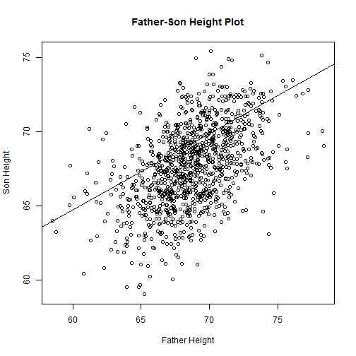

Predicting Sons Heights Wiht A Simple Linear Regression Model
========================================================
author: Sepand Haghighi
date:    4/16/2015

## Developing Data Product Final Project


Introduction :
========================================================


In this simple project we estimate sons height with a simple linear regression with fathers heights as predictor.

You can visit application of this model on this links :

[https://sepandhaghighi.shinyapps.io/Project]
[https://sepandhaghighi.shinyapps.io/shiny] 

Work with this application in easy you can choose Centimeter Or Inch And Then Enter Your Number . . . 

Input Data
========================================================
Loading Libs and a little summary :

```r
library(UsingR)
temp<-father.son
summary(temp)
```

```
    fheight        sheight    
 Min.   :59.0   Min.   :58.5  
 1st Qu.:65.8   1st Qu.:66.9  
 Median :67.8   Median :68.6  
 Mean   :67.7   Mean   :68.7  
 3rd Qu.:69.6   3rd Qu.:70.5  
 Max.   :75.4   Max.   :78.4  
```

Create Model:
========================================================

```r
model<-lm(sheight~fheight,data=temp)

print(model)
```

```

Call:
lm(formula = sheight ~ fheight, data = temp)

Coefficients:
(Intercept)      fheight  
     33.887        0.514  
```

Result :
==========================================

```r
plot(temp$sheight,temp$fheight,main="Father-Son Height Plot" , xlab="Father Height" , ylab= "Son Height")
abline(model)
```

 

